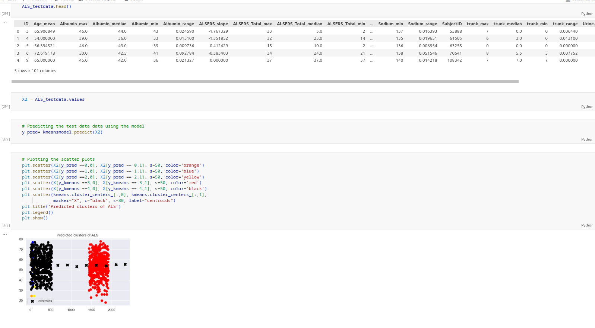

# Amyotrophic Lateral Sclerosis (ALS) Case-Study Cluster Analysis

## About the Model

In this task, the ALS dataset that was provided by the client was used to carry out the analysis. The task aimed to establish what patient’s phenotypes could be automatically and reliably identified and used to predict the change of AlSFRS slope over a period using the K-Means clustering algorithm.

Dataset: There were two main datasets applied for this analysis; training dataset and testing dataset. The training dataset contained 2223 observations and 101 variables. The testing dataset contained 78 observations and 131 variables.

Data preprocessing and visualization: Different visualizations were used in this analysis. For example, a heatmap was used to show none of the null values existed in the data. A histogram was used to visualize the distribution of the AlSFRS slope. Additionally, correlation matrix figures were used to reveal elements that had some correlation with the AlSFRS slope. Also, a line graph and scatter plot were used to show better cluster numbers and different clusters respectively.

Applying the model, prediction, and results:  
Using the K-Means algorithm, two k- values were used; k=3, k=5.
k=3, the performance was inadequate and only displayed three different clusters as shown below.
K=3 for the training data

k=3, for the testing data/predicted results

Using k=5, the results were better and the number of clusters increased both in the training and testing results
K=5 for the training data

K=5 for the testing data/predicted results

### Conclusion

Significantly, the model was able to predict at least two of the testing data clusters correctly. Also, the trunk_min and hand_min revealed some moderate correlations that would somehow explain the phenotypes’ impact on the AlSFRS slope. Reasonably, this may also explain the results of the two main clusters on the predicted results.
